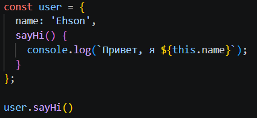
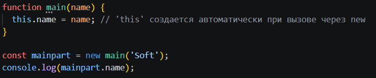
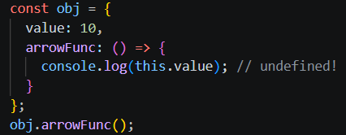
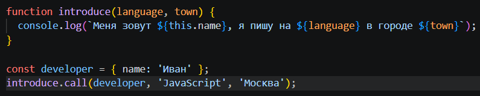
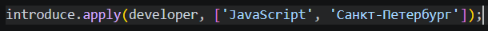
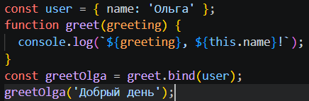

# Что такое `this`
### Главное правило, которое нужно запомнить: значение this почти никогда не зависит от того, где функция была объявлена. Оно зависит исключительно от того, как функция была вызвана.
## 1. Метод объекта (Неявная привязка)'
* Когда функция вызывается как метод объекта (через точку: obj.method()), this внутри этого метода указывает на сам объект перед точкой.

## 2. Обычный вызов функции (Глобальный контекст)
#### Если вызвать функцию просто по имени func(), её контекст теряется.
* В обычном режиме: this ссылается на глобальный объект (window в браузере или global в Node.js).
* В строгом режиме ('use strict';): this будет равен undefined. Это сделано для безопасности, чтобы случайно не изменить глобальные переменные.
## 3. Конструкторы (Новый объект)
* Когда функция вызывается с оператором new, JavaScript делает магию за кулисами: создается пустой объект, и this внутри функции начинает указывать на этот новый объект.

## 4. Стрелочные функции (=>)
* Стрелочные функции — особенные. У них нет своего this. Они запоминают this того места (окружения), где они были созданы. На них не влияют ни call, ни apply, ни bind.

### Почему тут undefined? Потому что объект {...} не создает область видимости для this. Стрелка была создана в глобальной области видимости, поэтому её this — это глобальный объект window, у которого нет свойства value.
# Часть 2: Явное управление контекстом — call, apply и bind
### Иногда тебе нужно жестко приказать функции: "Работай вот с этим объектом в качестве this". Для этого используются методы со второго слайда.
## 1. Метод call()
### Вызывает функцию немедленно, передавая контекст первым аргументом, а остальные аргументы — через запятую.

## 2. Метод apply()
### Делает абсолютно то же самое, что и call, но принимает аргументы для функции не по отдельности, а в виде массива.

## Как запомнить разницу между Call и Apply?
* Call — аргументы через Comma (запятую).
* Apply — аргументы через Array (массив).
## 3. Метод bind()
### В отличие от своих собратьев, bind не вызывает функцию сразу. Он создает и возвращает новую копию функции, намертво привязанную к указанному контексту. Её можно вызвать когда угодно позже.

### При работе с bind можно также "заранее" передать часть аргументов (это называется каррированием), как показано на твоем слайде (greet.bind(user, 'Hello')).