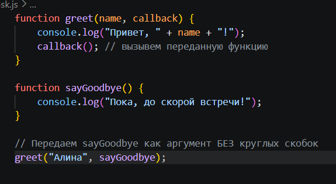
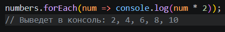
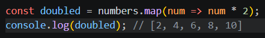
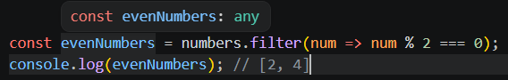
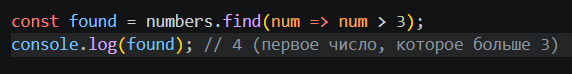
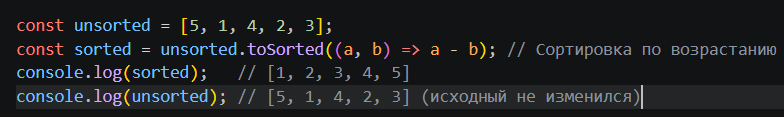
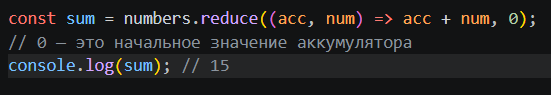
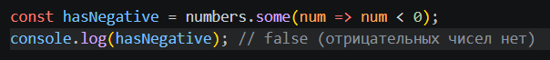
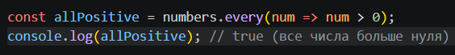

# Array-Callbacks

## Callback-функции (или просто коллбэки) — это одна из фундаментальных концепций в JavaScript. Как правильно замечено на ваших слайдах, это функции, которые передаются в качестве аргумента в другие функции, чтобы те вызвали их позже (когда выполнится определенное действие или условие).

### 1. Базовый принцип
#### В JavaScript функции являются «объектами первого класса». Это значит, что с ними можно обращаться как с обычными переменными: передавать в другие функции, возвращать из функций и присваивать переменным.

### 2. Коллбэки в методах массивов
#### Встроенные методы массивов в JS используют коллбэки для итерации (перебора) элементов. В каждый из этих методов передается функция, которая автоматически применяется к элементам массива.
1. forEach() — Просто перебор
* Используется вместо классического цикла for. Он просто выполняет указанную функцию один раз для каждого элемента. Ничего не возвращает.

2. map() — Трансформация массива
* Проходит по массиву, применяет функцию к каждому элементу и возвращает новый массив такой же длины с измененными данными.

3. filter() — Фильтрация
* Проверяет каждый элемент на соответствие условию. Если коллбэк возвращает true, элемент попадает в нового массив. Если false — отсеивается.

4. find() — Поиск первого совпадения
* Ищет элемент в массиве, который первым удовлетворяет условию. Как только находит — возвращает сам элемент и останавливает поиск. Если ничего не найдено — вернет undefined.

5. toSorted() — Безопасная сортировка
* Важное примечание: Классический метод sort() изменяет (мутирует) исходный массив. Появившийся недавно метод toSorted() делает то же самое, но возвращает новый отсортированный массив, оставляя старый нетронутым.
* В коллбэк (компаратор) передаются два элемента для сравнения:

6. reduce() — Свертка массива
* Используется для вычисления единого значения на основе всего массива (например, суммы всех чисел). Коллбэк принимает accumulator (накопитель) и currentValue (текущий элемент).

7. some() — Частичная проверка
* Проверяет, удовлетворяет ли хотя бы один элемент массива условию. Возвращает true или false.

8. every() — Полная проверка
* Проверяет, удовлетворяют ли абсолютно все элементы массива условию. Возвращает true или false.
