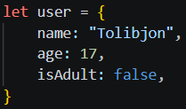
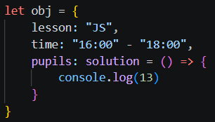
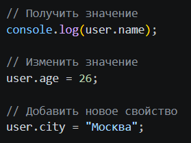
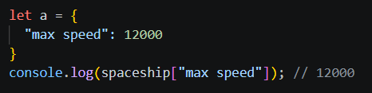
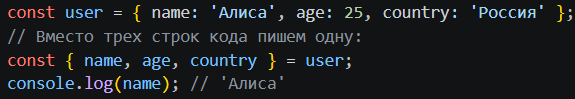
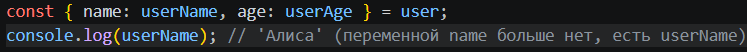

# Objects 

## Что такое объект? (What is an Object?)

### Объект — это концепция, описывающая любую сущность или идею (в данном случае машину). Он состоит из свойств (характеристик) и методов (действий).

## Свойства и Методы
### Данные внутри объекта делятся на два типа:
1. Свойства (Properties): Это переменные, привязанные к объекту (например, name или age выше).
2. Методы (Methods): Это функции, которые объект умеет выполнять.

## Как работать со значениями объекта?
#### Получить, изменить или добавить данные в объект можно двумя способами:
1. Через точку (самый частый способ)

2. Через квадратные скобки (нужно, если ключ состоит из нескольких слов или лежит в переменной)

## Перебор объектов (Iterating Over Objects)
### Объекты нельзя перебрать обычным циклом по индексам, как массивы.
### основных способа:
1. Цикл for...in: Перебирает все ключи объекта по очереди.
2. Object.keys(object): Возвращает массив, состоящий только из ключей объекта.
3. Object.values(object): Возвращает массив, состоящий только из значений объекта.
4. Object.entries(obj): Превращает объект в массив массивов, где каждая пара — это [ключ, значение].

## Деструктуризация (Destructuring)
### Это синтаксис, который позволяет «распаковывать» свойства объекта в отдельные переменные, чтобы не писать каждый раз user.name, user.age.
### Пример:

### Переименование переменных
#### Если вы хотите достать свойство из объекта, но сохранить его в переменную с другим именем, используйте двоеточие ::
